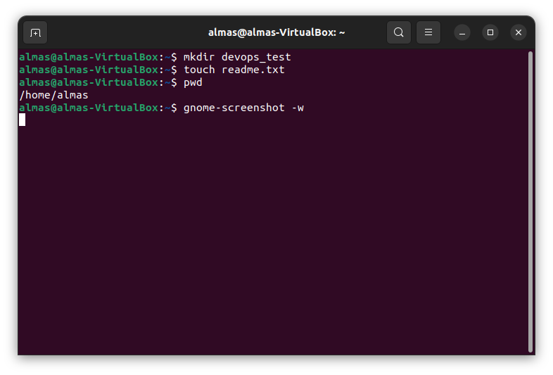
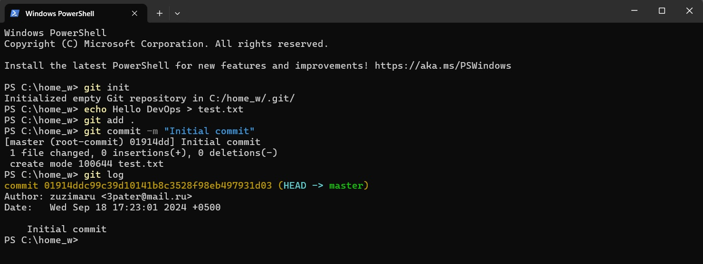

# Test answers

This repository contains the answers to the test cases

## Task 1: Screenshot of the Result

## Task 2: Screenshot of the Result

## Task 3:
IP-адрес (Internet Protocol Address) — это уникальный числовой идентификатор, который используется для обозначения каждого устройства, подключённого к сети, будь то Интернет или локальная сеть. Он необходим для того, чтобы устройства могли идентифицироваться и обмениваться данными.

IP-адреса бывают двух типов:
IPv4 (Internet Protocol v 4): Это наиболее распространённая версия IP-адресов. Адреса IPv4 состоят из 32 бит и обычно записываются как четыре числа (четыре десятичных чисел), разделённые точками (например, 192.168.0.1), но их количество ограничено.

IPv6 (Internet Protocol v 6): Более версия IP-адресов, использующая 128 бит, которая предоставляет гораздо больше уникальных адресов (например, 2001:0db8:85a3:0000:0000:8a2e:0370:7334 (записан в шестнадцатеричной системе счисления)). Она была введена для решения проблемы недостатка адресов в IPv4.

Назовите основные отличия между протоколами TCP и UDP - 
Надёжность. В этом плане TCP надёжнее, так как использует тайм-ауты, требует подтверждения получения данных и повторно отправляет данные при необходимости. У протокола UDP такого нет, данные нередко теряются на этапе доставки к хосту-получателю.

Упорядоченность. В TCP гарантированно передаёт пакеты данных именно в той последовательности, которая была задана изначально. В UDP такая возможность не реализована

Скорость. По этому параметру UDP превосходит TCP, который значительно быстрее тяжеловесного TCP, нуждающегося в установлении надёжного соединения и других необходимых для передачи данных условий.

Метод передачи данных. TCP предполагает потоковую передачу данных, границы фрагментов данных не обозначены. UDP использует метод датаграмм, когда получатель проверяет целостность пакетов лишь при получении сообщения. Пакеты данных в данном случае имеют обозначения границ.

## Task 4:

!/bin/bash  
for ((i=1; i <= 10; i++))  
do  
echo $i  
done

## Task 5:

Включаем первый выключатель, второй выключатель включаем на 6 минуты, третий не трогаем. Через 6 минут входим в комнату, включенная лампочка укажет на первый выключатель, далее нужно потрогать лампочки, горячая лампочка будет указывать на второй выключатель, а холодная на третий

